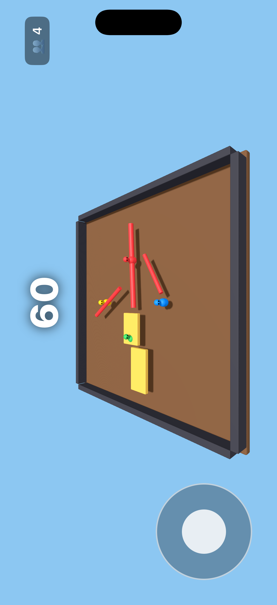

# Stumble Lite


A low-poly 3D knock-your-friends-off-the-platform game for iPhone. Built with Swift and SceneKit. Characters, arena, and obstacles are all SceneKit primitives — no 3D model files required.

Single-player works now. Local multiplayer over Multipeer Connectivity is next.



## Requirements

- macOS with Xcode
- An iPhone running iOS 16 or later (or the iOS Simulator)
- A free Apple ID for on-device signing

## Run it

1. Open `StumbleLite.xcodeproj` in Xcode.
2. Pick a simulator or a connected iPhone.
3. Press **⌘R**.

First time on a device: unlock the phone, tap **Trust This Computer**, then select the phone in Xcode’s device menu.

## How to play

- Use the on-screen joystick to move **Red**.
- **Blue**, **Green**, and **Yellow** are bots — they chase the nearest opponent and shove.
- Knock the other players off the platform before the timer runs out — or don't get knocked off yourself.
- Watch the spinning bars: they shove hard.
- Landscape only.

## Layout

```
stumble-lite/
├── README.md
├── StumbleLite.xcodeproj
└── StumbleLite/
    ├── AppDelegate.swift
    ├── SceneDelegate.swift
    ├── Info.plist
    ├── GameViewController.swift   # scene, HUD, physics, round timer
    ├── BotBrain.swift             # AI for the non-local players
    ├── JoystickView.swift         # on-screen stick
    ├── Player3D.swift             # capsule body + sphere head
    ├── Obstacle3D.swift           # moving platform, spinning bar
    ├── WinViewController.swift    # end-of-round screen
    ├── Physics.swift              # collision bitmasks
    └── Assets.xcassets/
```

## Tuning

In `GameViewController.swift`, look for `// MARK: TUNING`:

- `arenaSize` — floor size
- `wallHeight` / `wallThickness`
- `gravity`
- `roundSeconds`
- `dragNormalizationPixels`

In `Player3D.swift`:

- `bodyRadius`, `bodyMass`, `bodyFriction`, `bodyRestitution`
- `linearDamping`, `angularDamping`
- `inputForce`, `maxHorizontalSpeed`

In `BotBrain.swift`:

- `thinkInterval` — how often a bot re-picks its target
- `aggression` — bot force relative to the player's
- `edgeMargin` — how far inside the arena edge a bot turns back
- `wanderRate` / `wanderAmount` — steering wobble so paths curve

## Optional: swap in a real model

Drop a `.scn` / `.dae` file into the project, then in `Player3D.swift` replace `buildCharacter()` with:

```swift
private func buildCharacter() {
    let url = Bundle.main.url(forResource: "YourModel", withExtension: "scn")!
    let ref = SCNReferenceNode(url: url)!
    ref.load()
    addChildNode(ref)
}
```

Keep `configurePhysics()` as-is so the physics shape stays the same.

## Roadmap

- [x] Single-player 3D physics, obstacles, win condition
- [x] SceneKit lighting, shadows, low-poly characters
- [x] On-screen joystick
- [x] Bot opponents with simple AI (chase, shove, edge awareness)
- [ ] Multipeer Connectivity session (Bluetooth + Wi-Fi)
- [ ] Host / Join screen
- [ ] More maps
- [ ] Sound + haptics
- [ ] Optional character models
